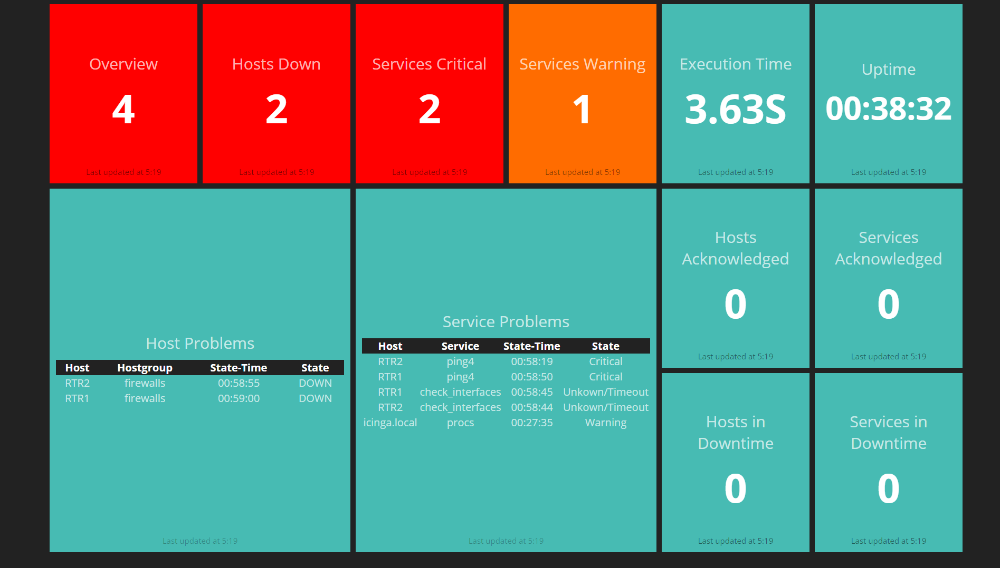
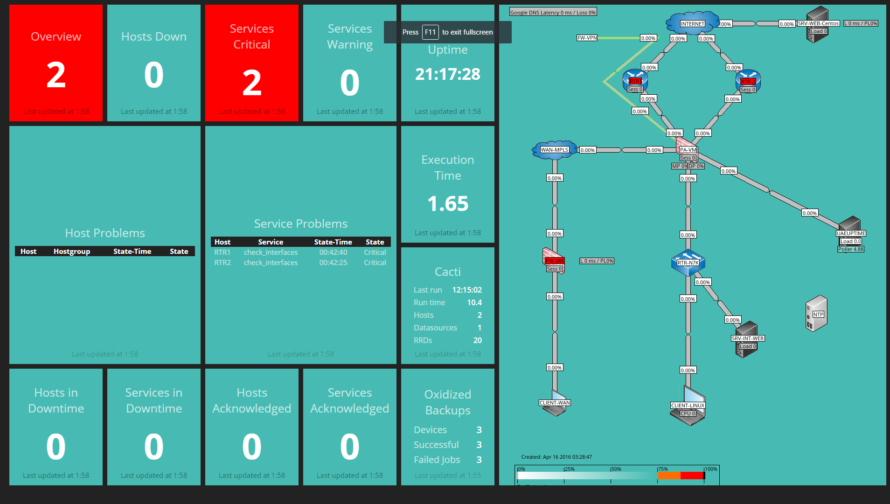

# General
This is a fork of [Icinga/Dashing-Icinga2](https://github.com/Icinga/dashing-icinga2). 
All credit for this great dashboard goes to the Icinga Team!

Dashinga2 is optimized for 1920*1080 screen resolution.

This dashing implementation uses the Icinga 2 API, Oxidized API and Cacti-Weathermap-plugin as well as the cacti.log to display alerts on screen.

Dashboard1:


Dasboard2:


# Contribute

All contributions is welcome, see TODO if you cant think of anything.

# License

* Dashing is licensed under the [MIT license](https://github.com/Shopify/dashing/blob/master/MIT-LICENSE).
* Icinga specific jobs and dashboards are licensed under the GPLv2+ license.

# Requirements

* Ruby, Gems and Bundler
* Dashing Gem
* Icinga 2 API (v2.4+)
*Optional:
*Oxidized
*Cacti with Weathermap Plugin

Gems:

    gem install bundle
    gem install dashing

## Icinga 2

Icinga 2 provides either basic auth or client certificates for authentication.

Therefore add a new ApiUser object to your Icinga 2 configuration:

    vim /etc/icinga2/conf.d/api-users.conf

    object ApiUser "dashing" {
      password = "icinga"
      client_cn = "icinga2a"
      permissions = [ "*" ]
    }

In case you want to use client certificates, set the `client_cn` from your connecting
host and put the client certificate files (private and public key, ca.crt) in the `pki`
directory.

> **Note**
>
> The job script will attempt to use client certificates once found in the `pki/` directory
> instead of basic auth.

## Dashing Configuration

Edit `jobs/icinga2.erb` and adjust the settings for the Icinga 2 API credentials.

# Run

Install all required ruby gems:

    bundle install

On OSX El Capitan [OpenSSL was deprecated](https://github.com/eventmachine/eventmachine/issues/602),
therefore you'll need to fix the eventmachine gem:

    brew install openssl
    bundle config build.eventmachine --with-cppflags=-I/usr/local/opt/openssl/include
    bundle install --path binpaths

Now start dashing:

    ./run.sh

(or `dashing start`).

Navigate to [http://localhost:3030](http://localhost:3030)

#Centos 7 Example
```
yum install ruby ruby-devel nodejs

cd /usr/share/
git clone https://github.com/micke2k/dashinga2

cd dashinga2

#Edit your jobs file with your API credentials
vi jobs/icinga2.rb

gem install bundler
gem install dashing
bundle install

dashinga start

firewall-cmd --permanent --add-port=3030/tcp
success
firewall-cmd --reload
```
Navigate to [http://localhost:3030](http://localhost:3030)

# Thanks

[roidelapliue](https://github.com/roidelapluie/dashing-scripts) for the Icinga 1.x dashing script.

# TODO

* Make colors in table reflect status eg. Warning = Yellow, Critical/Down = Red.
* Uptime - Show in days/hours/min/seconds.
* Add more columns to table by looping them instead of printing them.
* Make widgets go grey if Icinga2 goes down.
* Update the tables using batman/inline so they dont flash when updating.


